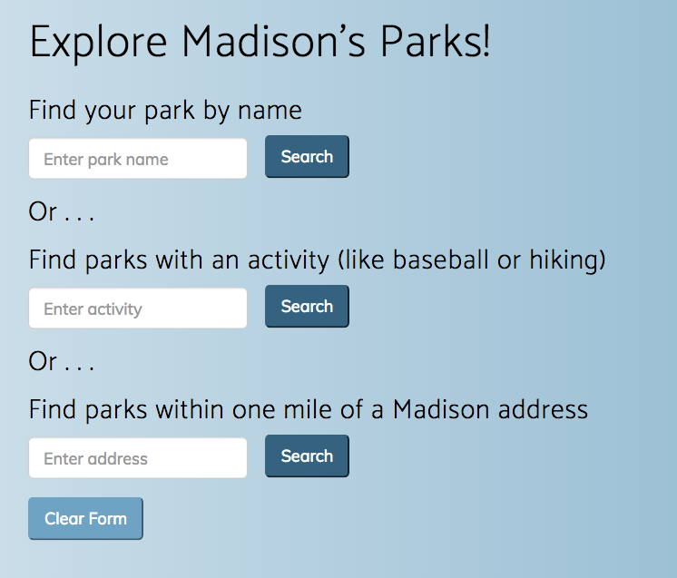

# Mad City Parks

### An app for public parks in Madison, Wisconsin. Built with Ruby on Rails, JavaScript, and open data from the City of Madison.

## Try it 
#### https://madcityparks.herokuapp.com/

## Why I built it
* I am interested in how technology can improve our civic life. So I wanted to do a project that took advantage of freely available public data. It turns out that the city of Madison has easy-to-use data sets accessible via the Socrata API. Take a look at the city's [data website](https://data.cityofmadison.com/) if you're interested. It's much more than parks!

* I wanted to learn more about how to use external APIs in a web application. This app uses the **Socrata API** with the [`soda-ruby`](https://github.com/socrata/soda-ruby) gem; Socrata has tools for other languages as well.

* This app gave me a chance to learn more about **Ruby on Rails**, **JavaScript**, and **CSS**. I downloaded and modified the [New Age](https://startbootstrap.com/template-overviews/new-age/) **Bootstrap** theme to create the look of the site. I also used **jQuery** for animations and **AJAX** for page loading.

* Finally: I love Madison! And parks!

## What it does
The app is easy to use. Users enter the name of a park, an activity (like baseball or hiking), or a Madison street address. The app returns a list of parks based on that input.

In the future, I plan to add an autocomplete feature to make the activities search more accurate. I will also add more options to the address search.

## By the way . . .
This is a personal project and not affiliated with the Madison city government. Please visit Madison's [Parks Division](http://www.cityofmadison.com/parks/) for official park information.
